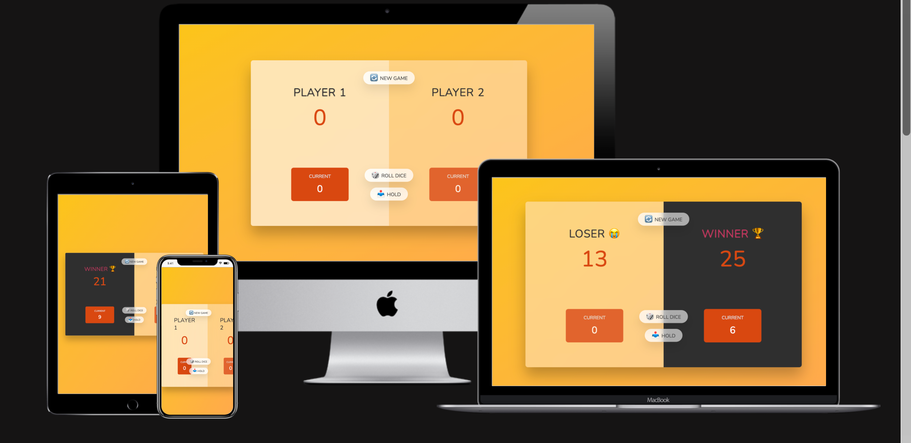
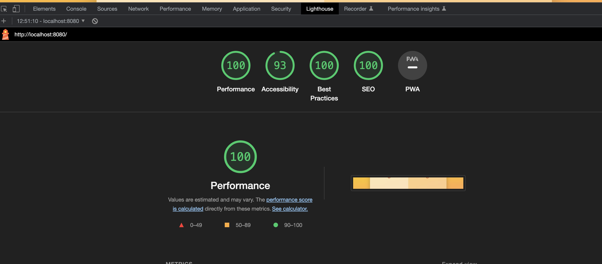

# Pig Game

Pig Game is a fun and exciting dice game where players compete to reach a target score. Roll the dice, strategically accumulate points, but be careful not to roll a '1' and lose your turn! Play against friends to see who can outsmart their way to victory.

This repository contains the JavaScript code that powers the Pig Game. Let's take a closer look at the functions and features of the game.

## Table of Contents

- [Features](#features)
- [Getting Started](#getting-started)
- [Game Rules](#game-rules)
- [Programes used](#programes-used)
- [Testing](#tesing)
- [Functions](#functions)
- [Contributing](#contributing)
- [License](#license)

## Features

- Engaging gameplay that tests your strategic decision-making skills.
- Multiplayer mode allows you to compete against friends or AI opponents.
- Simple and intuitive gameplay.
- Customize the target score to tailor the game's length according to your preferences.
- Real-time score tracking for each player.
- Interactive dice rolling animation adds excitement to the game.

## Getting Started

These instructions will help you get a copy of the project up and running on your local machine.

### Prerequisites

- Web browser (e.g., Chrome, Firefox)

### Installation

1. Clone the repository.
2. Open the project in your preferred code editor.

### Usage

1. Open `index.html` in your web browser.
2. Interact with the application and enjoy the confetti animation when a winner is declared.

- Enjoy playing the Pig Game!
  

## Game Rules

1. The game starts with Player 1.
2. Roll the dice by clicking the "Roll" button.
3. Each dice roll adds to the current score.
4. Avoid rolling a '1', as it will reset your current score to zero, and your turn will be passed to the next player.
5. You can continue rolling the dice to accumulate more points or click the "Hold" button to add your current score to your total score and end your turn.
6. The first player to reach or exceed the target score wins the game.

## Functions

The Pig Game code includes the following key functions:

- `switchPlayer()`: Switches the active player, resets the current score, and updates the UI to reflect the change.
- `btnRoll.addEventListener("click", function () { ... })`: Handles the dice rolling functionality. It generates a random dice roll, updates the UI with the rolled dice value, and adds the corresponding score to the current player's score. If a '1' is rolled, the turn is switched to the next player using the `switchPlayer()` function.
- `btnHold.addEventListener("click", function () { ... })`: Handles the "Hold" button functionality. It adds the current player's current score to their total score, checks if the player has reached or exceeded the target score for winning, and switches the player if necessary using the `switchPlayer()` function.
- `btnNew.addEventListener("click", function () { ... })`: Resets the game when the "New Game" button is clicked. It resets the scores, current score, active player, and other game-related variables. Additionally, it hides the dice, removes the winner status, and sets the initial active player.

## Programmes Used

- VsCode: Used to create and edit the app.
- GitHub: Used to store the code after being pushed and to deploy the live project!
  PEP8: was used to validate all the python code.

## Lighthouse

Lighthouse was used to test the app at all stages

Sure! Here's an example of how you can structure the "Technologies Used" and "Languages Used" sections in your README.md file for HTML, CSS, and JavaScript:

## Technologies Used

- HTML5
- CSS3
- JavaScript

## Languages Used

- HTML
- CSS
- JavaScript

In the "Technologies Used" section, you can list the specific technologies or libraries you utilized in your project. In this example, we included HTML5, CSS3, JavaScript, and the Confetti.js library (assuming you have added it to your project).

In the "Languages Used" section, you can list the programming languages you used to build your project. In this case, we listed HTML, CSS, and JavaScript.

Feel free to customize these sections based on the specific technologies and languages you used in your project.

## Contributing

Contributions to the Pig Game project are welcome. If you have any bug fixes, feature enhancements, or other improvements, feel free to submit a pull request. Please follow the standard coding conventions and maintain consistency with the existing codebase.

1. Fork the repository.
2. Create a new branch: `git checkout -b feature-name`.
3. Make your changes and commit them: `git commit -m 'Add some feature'`.
4. Push to the branch: `git push origin feature-name`.
5. Submit a pull request.

## License

The Pig Game project is licensed under the [MIT License](LICENSE).
